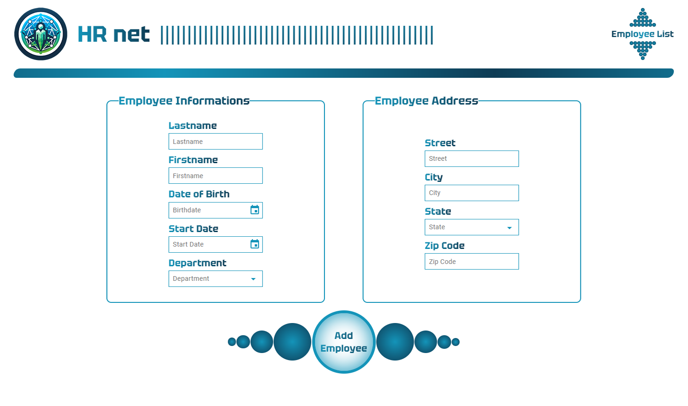
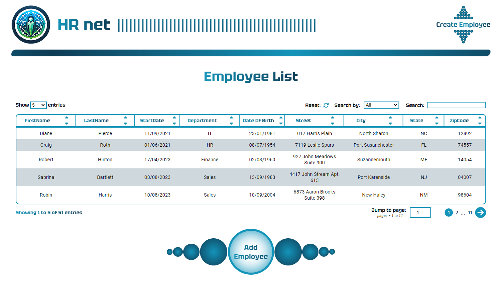

<h1>OC_P14</h1>

<div align='center'>

 
 
</div><br>

<h2>HR Net: Human Resource app</h2>

App for employee management, employee creation with a form, and a datatable for the list of employees including their informations.


[](https://github.com/Naereen/StrapDown.js/blob/master/LICENSE)


<strong>Project:</strong> From scratch, no reuse of OC jQuery code. 

<strong>Project goal:</strong> Moving a jQuery library to React, make a npm package.

<strong>Personal addition:</strong> many styles and pages for: home, form and employee list.

<strong>Make my own DataTable component npm package</strong>


<strong>Install dependencies:</strong>

```
npm i
```

<strong>run dev preview:</strong>

```
npm run dev
```

<strong>run sass</strong>

```
npm run sass
```

<strong>build:</strong>
```
npm run build
```

<strong>run build preview:</strong>
```
npm run preview
```
<br>

<strong>Link to my npm DataTable component (made from scratch):</strong><br>
https://www.npmjs.com/package/oc_react_datatable?activeTab=readme
<br><br>

<strong>MUI:</strong>
 - form select
 - form datePicker
 - form modal

<strong> Screenshots:</strong><br>
<div align='center'>

 

 

 
 
</div>